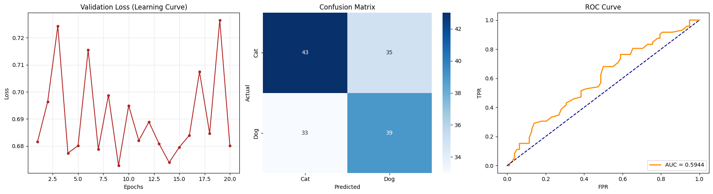

# neural-scratchpad-cats-dogs

# 🐾 Low-Level MLP Image Classifier (NumPy from Scratch)

## 🚀 The Challenge: Overcoming the "Dog Bias."
During initial development, the model plateaued, predicting the majority class (Dogs) for 100% of the data. This resulted in a flat learning curve and a high Binary Cross-Entropy (BCE) loss of **11.0**.

### Technical Pivots:
- **Xavier Weight Initialization:** Scaled initial weights to prevent Sigmoid saturation.
- **Leaky ReLU Activation:** Introduced to prevent the "Dying ReLU" problem in hidden layers.
- **Adam Optimizer Tuning:** Adjusted learning rate to `0.0001` to stabilize training.
- **Manual Metrics:** Implemented Precision, Recall, F1-Score, and ROC-AUC from scratch to validate class-wise performance.

## 📊 Results

- **Initial BCE Loss:** 11.02
- **Final BCE Loss:** 0.68
- **Peak Accuracy:** ~63%
- **ROC-AUC:** ~0.60

## 🛠️ Features
- **Backpropagation:** Full manual implementation of the chain rule.
- **Optimization:** Adam optimizer with momentum and bias correction.
- **Preprocessing:** Custom image loader with normalization and flattening.
- **Evaluation:** Visualized through Learning Curves, Confusion Matrices, and ROC Curves.
